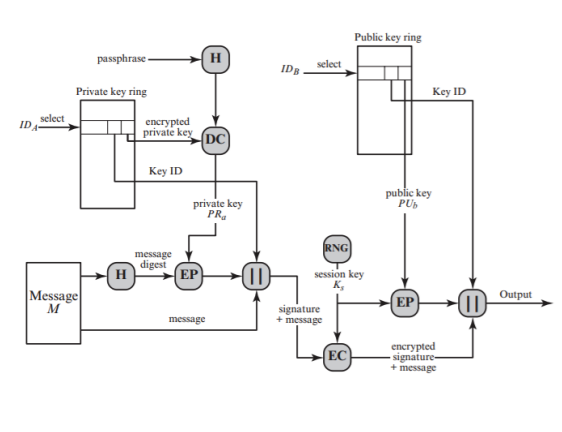
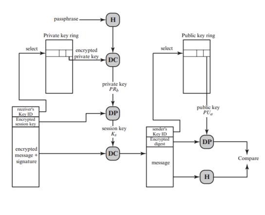
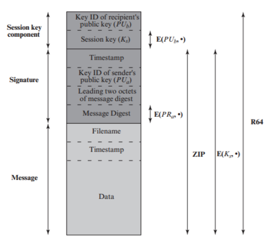
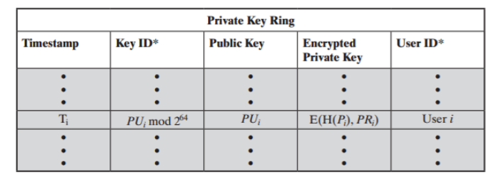
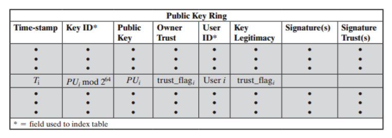
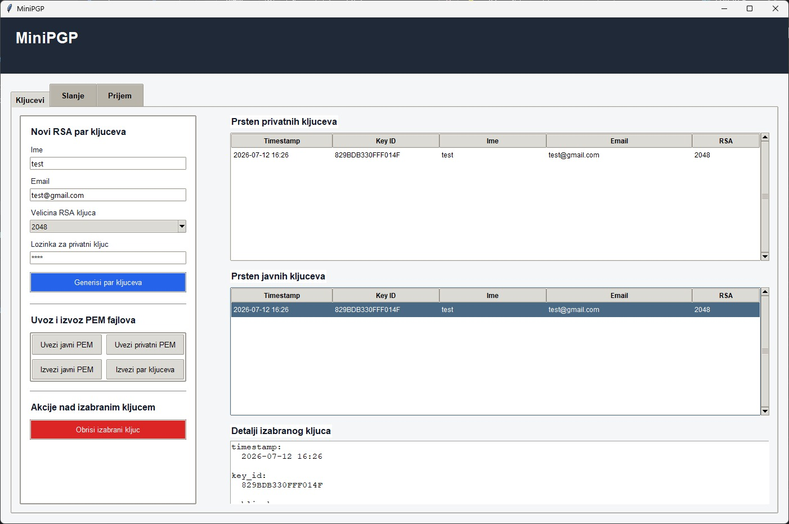
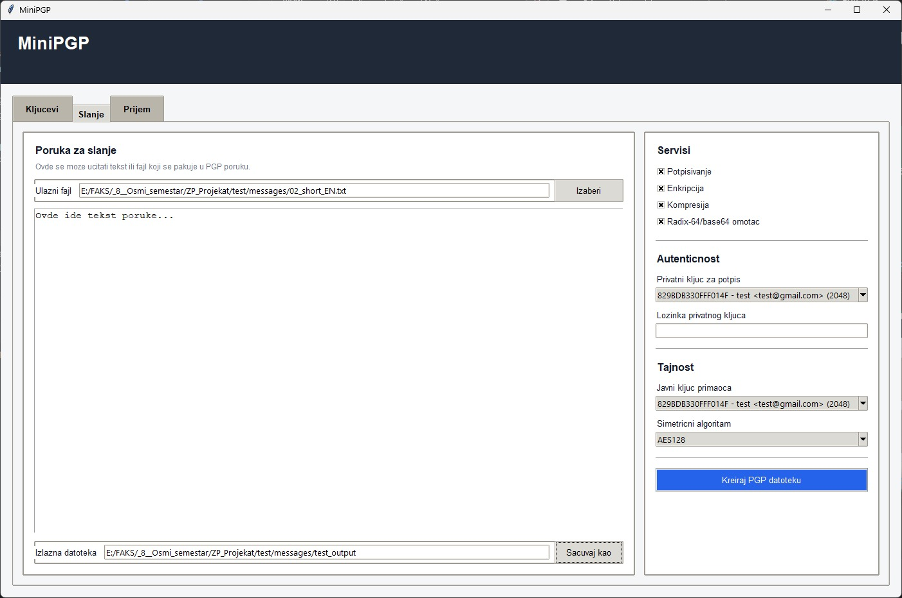
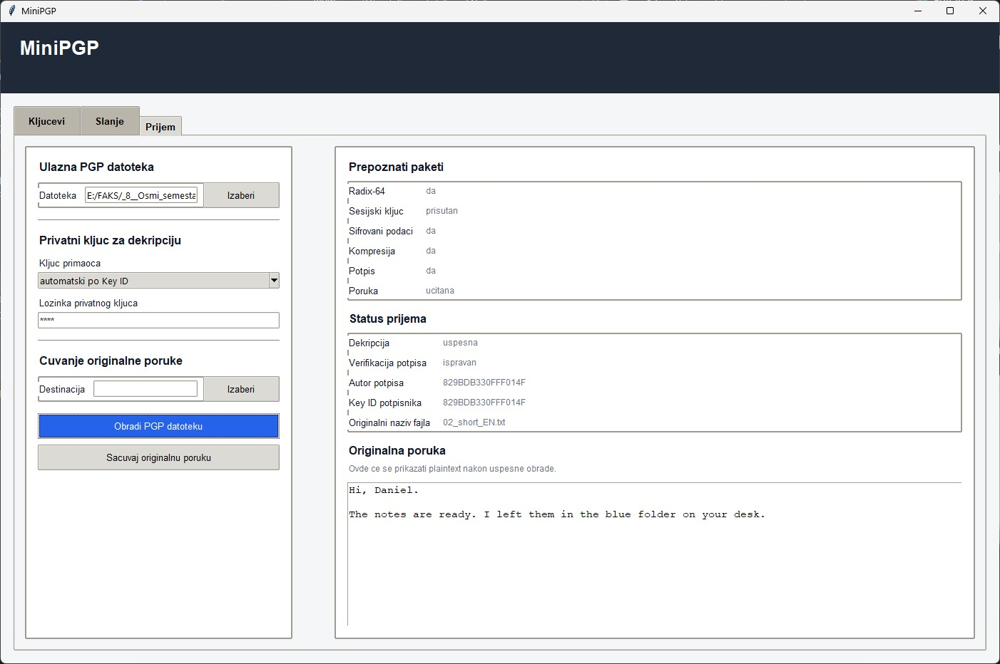

# Mini PGP

Mini PGP is an educational implementation of the main services provided by the Pretty Good Privacy system. The application allows users to manage RSA key rings and securely exchange files through a graphical user interface.

Messages can be digitally signed, compressed, encrypted and converted to Radix-64 format. The receiving process reverses the selected operations and verifies the sender's signature when present.

> Through this project, we gained a practical understanding of how PGP combines hashing, digital signatures, public-key cryptography, symmetric encryption, compression and Radix-64 encoding.
>
> Implementing both message sending and receiving helped us understand key management, session keys, message packaging and the importance of applying cryptographic services in the correct order.

## Contributors

- [Aleksandar Avramović](https://github.com/akithetsar)
- [Jovan Mosurović](https://github.com/JovanMosurovic)

## Table of Contents

- [Features](#features)
- [Sending a Message](#sending-a-message)
- [Receiving a Message](#receiving-a-message)
- [Message Format](#message-format)
- [Key Rings](#key-rings)
- [User Interface](#user-interface)
- [Running the Application](#running-the-application)
- [Project Structure](#project-structure)
- [Assignment Reference](#assignment-reference)

## Features

- RSA key pair generation using 1024-bit or 2048-bit keys
- Separate public and private key rings
- Import and export of PEM keys
- Password-protected private keys
- Digital signatures using RSA and SHA-1
- Symmetric encryption using AES-128 or Triple DES
- RSA encryption of symmetric session keys
- Optional zlib compression
- Optional Radix-64 encoding
- Signature verification during message reception
- Graphical user interface for all operations

## Sending a Message

During the sending process, the original message can first be signed using the sender's private key. The signed message is optionally compressed and encrypted using a randomly generated session key.

The session key is encrypted using the recipient's public key, while the final message can optionally be encoded using Radix-64.

<p align="center">
  
</p>

## Receiving a Message

The receiving process applies the selected services in reverse order. The recipient's private key is used to recover the session key, which is then used to decrypt the message.

After optional decompression, the original message is extracted and its signature is verified using the sender's public key.

<p align="center">
  
</p>

## Message Format

A Mini PGP message contains the original file data and information required for the selected services.

The message packet may contain:

- Original filename and timestamp
- Original file data
- Sender's public key ID
- Digital signature and signature timestamp
- Leading two octets of the message digest
- Recipient's public key ID
- Encrypted session key
- Selected symmetric algorithm
- Enabled service flags

The signed message forms the inner packet. It can then be compressed, encrypted and placed inside the outer packet before optional Radix-64 encoding.

<p align="center">
  
</p>

## Key Rings

The private key ring stores the user's RSA key pairs. Private keys are protected using a password, while the corresponding public key and owner information remain available for key identification.

<p align="center">
  
</p>

The public key ring stores public keys belonging to other users. These keys are used for message encryption and digital signature verification.

<p align="center">
  
</p>

## User Interface

<p align="center">
  
  
  
</p>

## Running the Application

Install the required dependency:

```bash
pip install cryptography
```

Run the application:

```bash
python main.py
```

## Project Structure

```text
mini-pgp/
├── core/
│   ├── crypto.py
│   ├── keyrings.py
│   └── message.py
├── gui/
│   └── app.py
├── test/
└── main.py
```

## Assignment Reference

Course: **Computer Security ([13S114ZP](https://www.etf.bg.ac.rs/en/fis/karton_predmeta/13S114ZP-2013))**  
Academic Year: **2025/2026**
University of Belgrade, School of Electrical Engineering  
Major: Software Engineering

For complete assignment details, implementation guidelines, and grading criteria, refer to [instructions.pdf](instructions.pdf).
